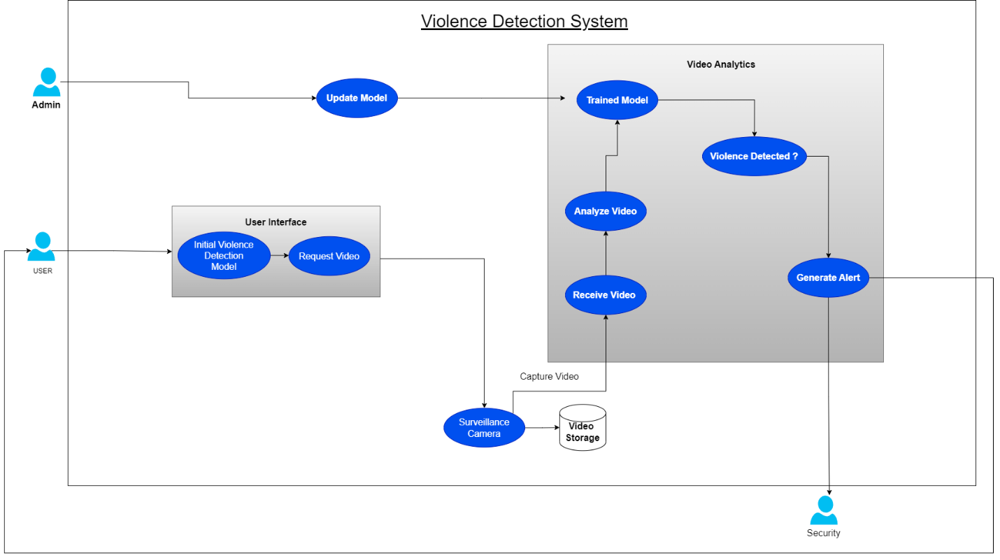
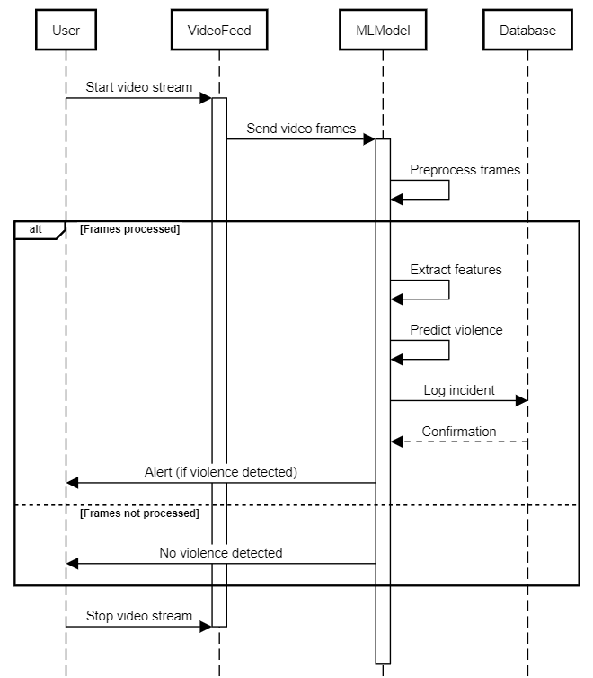
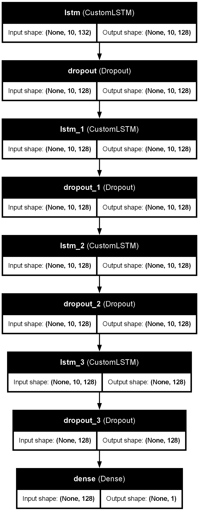

# 🔍 Violence Detection in Surveillance Videos

A real-time AI-powered surveillance system for detecting violent actions in video feeds using deep learning.

## 📌 Overview

This project aims to automate violence detection in surveillance systems using advanced deep learning techniques. It leverages Convolutional Neural Networks (CNN) and Long Short-Term Memory (LSTM) models to detect violent behavior in real-time, improving the accuracy and efficiency of traditional security setups.

> **Use Case:** Public/private surveillance systems, real-time alerting for improved response time, reducing manual monitoring errors.

## 🧠 System Architecture

The system is composed of multiple interconnected modules: input via surveillance cameras, intelligent video analysis using ML models, and alert generation.

### 🔹 Use Case Diagram

**Actors:**
- Admin: Maintains and updates the ML model.
- UI: Interface for analysis requests and alert reception.
- Surveillance Camera: Captures real-time video.
- Frame Reader: Reads frames from video.
- Analytics Module: Runs ML models.
- Security System: Receives alerts.

**Main Actions:**
- Capture video → Analyze → Detect violence → Generate alert → Model updates

### 🔹 Sequence Diagram

**Flow:**
User starts stream → Video processed → Model infers → Incident logged → Alert triggered

### 🔹 Model Architecture

**Techniques:** 
- CNN for spatial feature extraction
- LSTM for temporal behavior learning

---

## ⚙️ Tech Stack

- **Languages & Libraries:** Python, OpenCV, Pandas, NumPy, Scikit-learn, TensorFlow, Keras
- **ML Models:** CNN + LSTM
- **Tools:** Google Colab (training)
- **Storage:** CSV (lightweight, scalable to SQL/NoSQL)

## ❗ Challenges & Solutions

- **Video Quality Variability:** Adaptive preprocessing based on lighting and camera angles.
- **Hardware Bottlenecks:** Optimized lightweight CNN-LSTM models.
- **False Positives/Negatives:** Introduced confidence thresholds & ensemble methods.
- **System Integration:** Modular architecture for maintainability.

---

## 🧪 Testing & Quality Assurance

- **Interfaces:**  
  - Device (OpenCV VideoCapture)  
  - OS (File I/O via Pandas)  
  - User (Live frame feedback)  
  - CSV-based pseudo-database  
- **Testing Techniques:**  
  - Unit testing (module-level)
  - Integration testing (end-to-end pipeline)
  - Model validation (Precision, Recall, F1-score)
  - Backend and UI/UX performance tracking

---

## 📆 Timeline & Milestones

| Date         | Milestone                       |
|--------------|----------------------------------|
| Jan 15, 2025 | Project Kickoff                  |
| Jan 25, 2025 | Data Collection & Preprocessing  |
| Feb 05, 2025 | Model Prototyping                |
| Feb 20, 2025 | Model Training                   |
| Mar 05, 2025 | Integration & UI Development     |
| Mar 20, 2025 | Testing Phase                    |
| Apr 05, 2025 | Final Review                     |
| Apr 18, 2025 | Submission                       |

---

## 🚀 Future Plans

- 🔧 Add support for other threats: theft, fire, loitering
- ☁️ Migrate to cloud (AWS/Azure) for scalability
- 📱 Mobile + Web dashboards for remote access
- 🏙️ Integrate with Smart City surveillance infrastructure
- 🔁 Continuous model learning from real-world feedback
- 🌐 Multi-language UI
- 📊 Auto-generated analytics reports

---

## 👥 Contributors

- **Amit S Sahu** [500123854]  
- **Mradul Lakhotiya** [500125405]  
- **Yash** [500125397]

---

## 💡 Feedback & Contributions

PRs and feedback are welcome. Please raise issues for bugs, improvements, or ideas.
